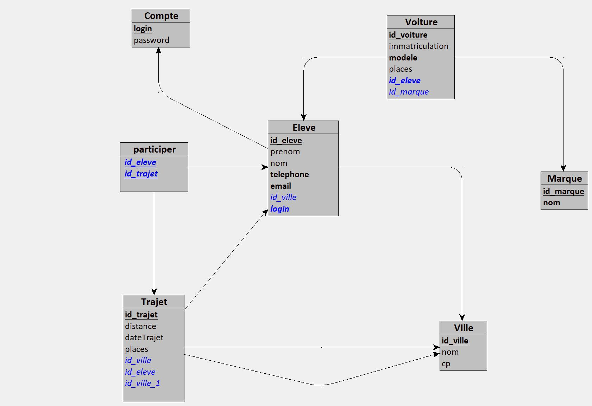

# ApiCovoiturage

## Introduction

This technical document is intended to provide a detailed understanding of the application we have developed. The
application is built using the PHP programming language and the Symfony framework. It also uses the
LexikJWTAuthenticationBundle for authentication, the Doctrine bundle for database management, and the NelmioApiDoc
bundle for API documentation. The main objective of this application is to provide a robust and secure API. This API
allows users to interact with the application in an efficient and secure manner. The specific details of the API,
including the available routes and examples of requests and responses, will be discussed in more detail in the following
sections of this document. This document will also cover the details of the application configuration, the application
features, the API usage guide, the tests, the deployment of the application, and the maintenance and support. We hope
that this document will help you understand our application more deeply and use it effectively.

## Application Description

The application is an API called ApiCovoiturage. It is built using the PHP programming language and the Composer
dependency manager. The main framework used is Symfony, which provides a solid and flexible structure for the
development of the application. The application uses several bundles to provide specific features. The
LexikJWTAuthenticationBundle is used for authentication, allowing users to securely log in to the application. The
Doctrine bundle is used for database management, facilitating interaction with stored data. The NelmioApiDoc bundle is
used for API documentation, providing a user interface for viewing and interacting with the API. The application exposes
several routes under the /api path, except for /api/doc which is reserved for API documentation. One of these routes is
/api/login_check, which is used for user authentication. The current version of the API is 1.0.0, as indicated in the
NelmioApiDoc configuration. In the following sections of this document, we will detail further the application
architecture, the API configuration, the application features, the API usage guide, the tests, the deployment of the
application, and the maintenance and support.

## Application Architecture

The architecture of the ApiCovoiturage application is based on the MVC (Model-View-Controller) model which is commonly
used in web development. This model divides the application into three interconnected components, allowing for a
separation of concerns.

## Programming Languages Used

The application is primarily written in PHP, a widely used programming language for web development. PHP is used for the
business logic of the application, including the processing of HTTP requests, interaction with the database, and the
generation of HTTP responses.

## Diagrams

In this section, we will present the different diagrams that represent the architecture and structure of the
application.
### Class Diagram - Model

### Class Diagram - Controllers

### MCD

### MLD

## Application Configuration

The configuration of the ApiCovoiturage application is managed through several files located in the config/ directory of
the project.

## API Configuration

The API configuration is defined in the config/packages/nelmio_api_doc.yaml file. This file contains information about
the API, including its title, description, and version. It also defines the areas of the API that should be documented.
Currently, all routes under /api are documented, except for /api/doc.

## NelmioApiDoc Configuration

The configuration of NelmioApiDoc is managed in the AppKernel.php file. This file registers the NelmioApiDoc bundle in
the application.

## Bundles Configuration

The configuration of the bundles used by the application is defined in the config/bundles.php file. This file returns an
associative array where the keys are the names of the bundle classes and the values are the environments in which these
bundles are activated.

## Application Features

ApiCovoiturage offers a variety of features to facilitate interaction with the API. Here is a list of the main features
of the application:

- Authentication
- User management
- Car management
- Journey management
- Student journey registration
- API documentation
- Error handling
- Security

## API Usage Guide

Authentication is managed by the LexikJWTAuthenticationBundle. To authenticate, you must send a POST request to
/api/login_check with your credentials. In case of success, you will receive a JWT token that you will need to include
in the Authorization header of your subsequent requests to access protected routes.

## Tests

The tests of our application are performed using SonarQube and GitLab. SonarQube is a static code analysis tool that
helps us maintain code quality by detecting bugs, vulnerabilities, and code issues. GitLab, on the other hand, is used
for continuous integration (CI) and continuous deployment (CD), allowing us to verify that our application works
correctly with each commit.

## Conclusion

The ApiCovoiturage application is a robust and flexible solution for managing carpooling among students. Thanks to a
well-designed and secure API, users can easily manage cars, journeys, and journey registrations. The application is
built using the PHP programming language and the Symfony framework, with the support of several bundles to provide
specific features. The authentication is managed by the LexikJWTAuthenticationBundle, the database management is
facilitated by the Doctrine bundle, and the API documentation is provided by the NelmioApiDoc bundle. The tests of the
application are performed using SonarQube and GitLab, thus ensuring the quality of the code and the proper functioning
of the application. The deployment of the application is also automated thanks to GitLab. In short, ApiCovoiturage is a
complete solution for managing carpooling among students, offering an easy-to-use interface and a solid and secure
architecture.